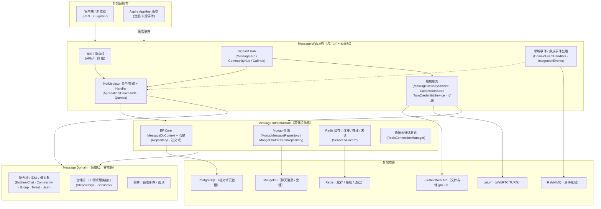
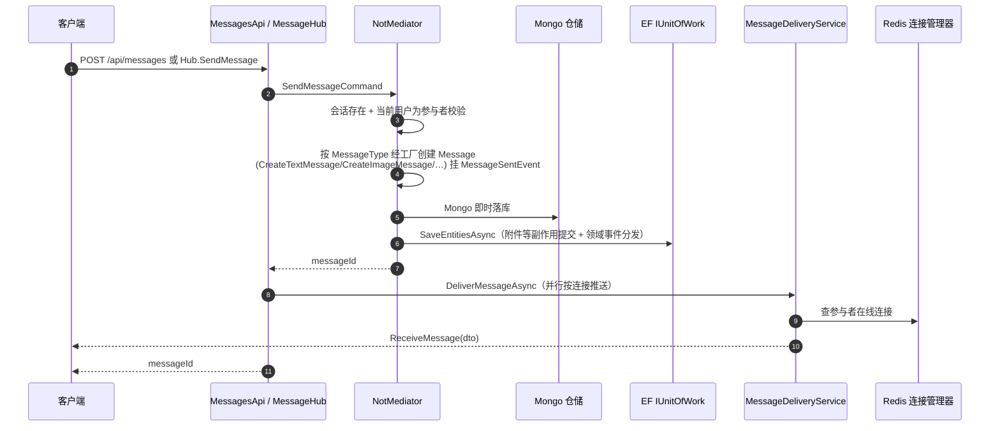
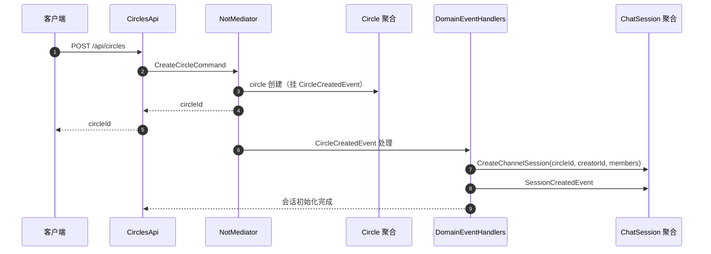
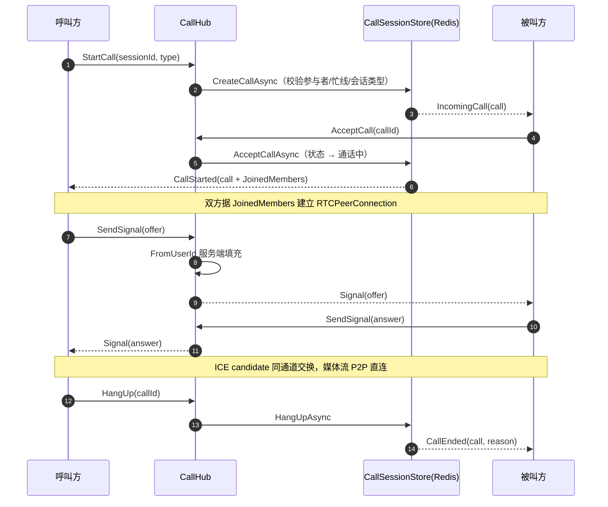

# Message 消息服务 · 开发文档

> 面向在本项目上做开发的工程师。描述架构分层、核心模式、关键业务链路、编码约定与扩展指南。
> 覆盖范围：`Message.Domain` / `Message.Infrastructure` / `Message.Web.API` 三个项目。

---

## 1. 架构总览

严格遵循 **DDD 分层**，依赖方向单一：`Web.API → Infrastructure → Domain`（Web.API 也直接依赖 Domain）。

### 1.1 各层职责

**Domain（领域层，零依赖）**
- 不引用 Infrastructure / Web.API；仅依赖 `NotMediator`（抽象）与 `Commons`。
- 核心聚合根：`Message`、`ChatSession`、`Group`、`Circle`、`Tweet`、`MessageFriends`、`UserInfo`。
- 领域事件定义在 `Message.Domain/Events`（44 个）；仓储/领域服务只定义接口。
- 关键抽象（防跨上下文耦合）：
  - `IMessageRecallPolicy`：消息撤回策略抽象，**Message 实体不直接引用 Recall 相关实体**，经该接口依赖反转。
  - `IConnectionManager` / `IConnectionCommandService`：连接管理查询/命令侧接口。
  - `IPermissionService`、`ISensitiveWordFilter`、`IImageModerationService`、`IEmailSender`、`ILocalizationService`。

**Infrastructure（基础设施层）**
- `EntityFramework/MessageDbContext`：PostgreSQL EF Core，同时实现 `IUnitOfWork`（`SaveEntitiesAsync` 先分发领域事件再提交）。
- `Repository/*`：社交域仓储（EF）+ `MongoMessageRepository`/`MongoChatSessionRepository`（聊天读写，后注册覆盖前者）。
- `Mongo/*`：文档投影（纯 POCO）、`ChatMessageMapper`/`ChatSessionMapper` 互转、`MongoChatCollection` 集合装配（类映射 + 幂等索引）。
- `Services/*`：Redis 连接管理、缓存服务（消息/会话/未读/在线状态）、默认策略实现（召回/敏感词/图片审核/邮件/本地化）、社区事件发布器（RabbitMQ / No-op）。
- `Migration/MessageMongoMigrationService`：存量 PG → Mongo 一次性迁移。
- `ServiceCollectionExtensions`：DI 统一装配。

**Web.API（应用层 + 表现层）**
- `APIs/*`：15 组 REST 端点（静态函数模式）。
- `Hubs/*`：MessageHub / CommunityHub / CallHub 实时通道。
- `Application/Commands · Queries`：CQRS 命令/查询 + Handler（80+ 命令、50+ 查询）。
- `Application/DomainEventHandlers / IntegrationEvents`：领域/集成事件处理。
- `Services/*`：消息并行推送、社区频道推送、通话状态机、TURN 凭证、内容清洗、敏感词、可见性策略。
- `Middleware/*`：`UserContextMiddleware`（JWT 身份注入）、`ExceptionHandlingMiddleware`（全局异常）。
- `Grpc/FileStorageGrpcClient`：下游 FileDev 文件服务客户端。
- `Program.cs`：启动装配；`Dockerfile` 容器化（EXPOSE 8084）。

---

## 2. 核心模式与依赖

### 2.1 CQRS（NotMediator）

所有写操作走**命令（Command）**、读操作走**查询（Query）**，经 `INotMediator.SendAsync` 分发：

- **命令**只返回操作结果（bool / 新实体 ID），不返回业务实体/DTO。例：`SendMessageCommand`、`CreateSessionCommand`、`CreateCircleCommand`、`RecallMessageCommand`。
- **查询**只读、不修改状态。例：`GetSessionMessagesQuery`、`GetUserSessionsQuery`、`GetCircleQuery`、`GetTimelineQuery`。
- 每个 Handler 只做**组装与编排**，纯业务规则保留在领域实体/领域服务内。

### 2.2 静态函数端点模式

`APIs/*.cs` 采用 **RouteGroupBuilder + 静态函数**：

- 所有端点处理程序为静态函数（不使用 Action/Lambda）。
- 依赖服务经 `[FromServices]` 注入，生命周期由服务注册文件统一管理。
- 路由参数（如 `{id}`）按名称绑定，请求体用 `[FromBody]`，分页/开关用 `[FromQuery]`。
- 字面量路由优先注册（如 `/api/circles/join` 先于 `/{circleGuid}`），避免路由冲突。

### 2.3 领域事件（进程内）

- 领域实体通过 `AddDomainEvent(...)` 挂载事件；`MessageDbContext.SaveChangesAsync` 前由 `IUnitOfWork.SaveEntitiesAsync` 统一分发。
- 处理类位于 `Application/DomainEventHandlers`（31 个）：
  - 会话同步：`SessionCreatedEventHandler`、`GroupCreatedEventHandler`、`GroupDissolvedEventHandler`、`CircleDissolvedEventHandler`、`CircleMemberJoinedEventHandler`、`CircleMemberLeftEventHandler`。
  - 消息副作用：`MessageSentEventHandler`、`MessageReadEventHandler`、`MessageRecalledEventHandler`、`MessageForwardedEventHandler`。
  - 社区/推文通知：`TweetCreatedEventHandler`、`CommentAddedEventHandler`、`UserFollowedEventHandler`、`CirclePostPublishedEventHandler` 等。

### 2.4 集成事件（跨服务，EventBus/RabbitMQ）

- `IntegrationEvents/EventHandlers`：
  - `RegisterByUserIntegrationEventHandler`：新用户注册事件 → 初始化用户资料（等级/硬币）。
  - `UploadByUserAvatarIntegrationEventHandler`：头像上传事件消费。
- 交换机 `notcomd_event_bus`（Direct），订阅客户端名 `message_community_events`。
- 社区事件发布器：`CommunityEventBus:Enabled=true` 时用 `RabbitMqCommunityEventPublisher`，否则 No-op。

### 2.5 双存储策略（EF + Mongo）

| 数据域 | 存储 | 读写入口 |
| --- | --- | --- |
| 聊天消息 `Message` | MongoDB `chat_message` | `MongoMessageRepository` |
| 聊天会话 `ChatSession` | MongoDB `chat_session` | `MongoChatSessionRepository` |
| 社交域（群/推文/圈子/好友/用户/通知/附件） | PostgreSQL（EF Core） | 各 EF 仓储 |

- `AddMessageMongoRepositories()` 在 `RegisterRepositories()` 之后调用，利用 **AddScoped 后注册者胜出**覆盖消息/会话仓储；社交域保留 EF。
- Mongo 文档为纯 POCO（含物理耦合），由 `ChatMessageMapper` / `ChatSessionMapper` 与领域聚合互转，**领域程序集不引入 MongoDB 依赖**。
- 消息发送的领域事件副作用（如附件记录）仍经 EF `IUnitOfWork` 提交（即时落库 + 副作用事务）。

### 2.6 Mongo 集合与幂等索引（`MongoChatCollection`）

- `chat_message`：(SessionId, SentTime desc) / (ReceiverId, Status) / (SenderId, SentTime desc)。
- `chat_session`：Participants（多键）/ SessionType / CircleId。
- 索引创建为幂等（重名忽略），多实例启动不冲突。
- `chat_session` 文档含 `Version` 乐观锁字段（替换 EF ConcurrencyToken）。

### 2.7 缓存与在线状态（Redis）

- `MessageCacheService`：消息详情缓存，**Key 带用户维度**（`message:msg:{userId}:{messageId}`），防跨用户缓存绕过权限；TTL 30min。
- `SessionCacheService`：会话详情缓存（跨用户共享，命中时仍须按参与者校验权限）。
- `UnreadCountCacheService`：未读计数；已读/撤回时写失效。
- `UserStatusCacheService`：在线状态唯一入口（`message:user:status:{userId}` + `message:online:users`）。
- `RedisConnectionManager`：连接管理权威来源（跨实例无重复推送），实现 `IConnectionManager` + `IConnectionCommandService`。

### 2.8 实时通信（SignalR 三 Hub）

| Hub | 路径 | 职责 |
| --- | --- | --- |
| `MessageHub` | `/MessageHub` | 连接生命周期、会话消息收发、已读/撤回、正在输入、会话群组（`session:{id}`）、文件分片上传（gRPC 代理） |
| `CommunityHub` | `/CommunityHub` | 圈子频道订阅（`circle:{id}`），成员实时接收新帖/评论/点赞/成员变动 |
| `CallHub` | `/CallHub` | WebRTC 呼叫控制 + 信令转发，通话状态存 Redis（`CallSessionStore`） |

- 认证：三个 Hub 均 `[Authorize]`，WebSocket 从 `access_token` 查询参数读取 JWT；用户身份从 `sub`/`NameIdentifier`/`user_guid` Claim 解析，**不回退信任请求头**。
- 消息推送：`MessageDeliveryService.DeliverMessageAsync` 按连接**并行**推送（Redis 连接管理器为权威，跨实例无重复），并通过 `session:{id}` 群组广播双通道投递。

### 2.9 通话状态机（CallSessionStore）

- 状态存 Redis，跨实例一致；支持 1 对 1 与群组通话（Mesh 全网状拓扑，媒体流 P2P 直连）。
- 状态流转：`StartCall`（响铃）→ `AcceptCall`/`JoinCall`（通话中）→ `HangUp`/`CancelCall`/超时/断线（结束）。
- 忙线判定、响铃超时兜底、断线自动移出通话；`CallHub` 断线时若用户无其他连接则自动离开通话。
- 信令转发：`SendSignal` 的 `FromUserId` 由**服务端权威填充**，客户端不可伪造。

---

## 3. 关键业务链路

### 3.1 消息发送（REST 与 SignalR 双通道共用同一命令链路）

> 媒体消息（图片/视频/音频/文件）先经 `/api/files/*` 或 Hub 分片通道上传获得 FileId，再以 `SendMessageRequest.FileId` 引用；`SendMessageCommand` 内完成 FileDev 归属校验与附件创建。

### 3.2 社区创建 → Channel 会话自动同步

- 成员加入/离开圈子经 `CircleMemberJoinedEvent` / `CircleMemberLeftEvent` / `CircleMemberRemovedEvent` 驱动会话参与者同步。
- **Circle 是社区名/解散状态单一真相源**，ChatSession 经 `CircleId` 只读投影，不镜像冗余（`Group` 同理经 `GroupId` 投影）。

### 3.3 群组/社区解散 → 会话解散

`GroupDissolvedEvent` / `CircleDissolvedEvent` → 对应处理器将关联 `ChatSession` 置为 `IsDismissed`，确保数据一致性（`SessionType=Group` 经 `GroupId` 关联、`SessionType=Channel` 经 `CircleId` 关联）。

### 3.4 语音/视频通话建立（WebRTC over SignalR）

### 3.5 文件分片上传（断点续传，REST + SignalR 双通道）

- 统一经 `IFileStorageGrpcClient` 代理到 FileDev.Web.API 的 gRPC 文件服务。
- REST：`/api/files/chunk/init|upload|status|merge|cancel|resume`；SignalR：Hub 同名方法。
- `ResumeChunkUpload` 一次性提交缺失分片，每片完成经 `IMessageClient.UploadProgress` 实时推送进度。
- 小文件（≤10MB）走 `/api/files/upload`、图片走 `/api/files/upload-image`（含格式校验与尺寸解析）。

---

## 4. 认证与安全

1. **JWT 双通道认证**：REST 走 `Authorization: Bearer`；SignalR 从 `access_token` 查询参数读取（WebSocket 无法带自定义头）。
2. **身份权威**：用户 id 一律取服务端从 JWT Claim（`sub`/`NameIdentifier`/`user_guid`）解析的值，不信任客户端传参；`UserContextMiddleware` 将身份注入 `ICurrentUserService`。
3. **权限校验**：会话/圈子/文件访问守卫（`CommunityAccessGuard` / `FileAccessGuard`）；群组/圈子成员关系强校验（Hub 与端点双重校验）。
4. **CORS**：生产环境必须配置 `CorsSettings:AllowedOrigins` 白名单；禁止 `AllowAnyOrigin` 与 `AllowCredentials` 共存。
5. **内容安全**：`SensitiveWordFilter`（敏感词过滤）、`SafeContentSanitizer`（内容清洗）、`IImageModerationService`（图片审核，可替换实现）。
6. **信令防伪造**：`CallHub.SendSignal` 的 `FromUserId` 服务端权威填充。
7. **全局异常**：`ExceptionHandlingMiddleware` 统一映射错误，不泄露内部堆栈。

---

## 5. 编码约定

1. **分层职责**：领域层零依赖；业务规则放领域实体/领域服务，Handler 只做编排，推送/IO 下沉到服务。
2. **一个文件一个类**；按功能放入对应目录（`Entities/Chat`、`Repository/`、`Commands/<模块>/` 等）。
3. **跨上下文抽象**：Message 实体不得直接引用跨上下文的 Recall 相关实体，必须通过 `IMessageRecallPolicy` 抽象依赖。
4. **单一真相源**：群名/解散状态以 `Group` 为准、社区名/解散状态以 `Circle` 为准，ChatSession 只读投影（`GroupId`/`CircleId`），避免镜像冗余。
5. **多类型消息内聚**：消息载荷由单一多态值对象 `MessageContent` 承载（字段收敛），各业务类型经 `MessageType` 判别；通过工厂方法（`CreateImageMessage` 等）封装创建，控制读写侵入。
6. **Mongo 重建**：消息/会话实体提供 `Rebuild` 静态工厂方法，从 Mongo 文档重建富聚合（不重新校验/不发领域事件）。
7. **映射专用类**：文档 ↔ 实体互转走 `ChatMessageMapper`/`ChatSessionMapper`，不散落在仓储内。
8. **公开成员必有文档注释**（`/// 
`），关键前置条件、异常、幂等语义需写明。
9. **缓存安全**：带用户维度的缓存 Key（消息详情）防跨用户命中绕过权限；共享缓存命中时仍须校验权限。
10. **不信任客户端输入**：userId 处处以服务端解析的调用者为准；文件归属/会话成员关系服务端强校验。

---

## 6. 扩展指南

### 新增一个 REST 端点（示例：新增「获取会话最后活跃时间」）

1. Web.API 新增 `Query`（如 `GetSessionActiveQuery`）+ `QueryHandler`（只读，返回 DTO）。
2. 在对应 `APIs/<模块>Api.cs` 中 `group.MapGet(...)` 挂载静态函数端点，`[FromServices] INotMediator` 注入中介者。
3. 如涉及新数据，先在 Domain 定义仓储接口方法、Infrastructure 实现（EF 或 Mongo）。

### 新增领域能力（示例：新增「消息已读回执增强」）

1. Domain 在聚合上新增行为方法 + 领域事件（如 `MessageReadEvent`）。
2. Web.API 新增 `DomainEventHandlers/<事件>EventHandler.cs`，在 `MessageDbContext` 分发时被调用。
3. 如需推送，在 Handler 内调用 `MessageDeliveryService`；如需缓存失效，调用 `UnreadCountCacheService`。
4. 跨服务需求 → 增加集成事件模型 + Handler，并在 `Program.cs` 注册（注意 RabbitMqEventBus 为 Singleton 非 Try 注册、只能调用一次）。

### 新增实时事件（示例：社区「帖子被分享」实时通知）

1. 在 `ICommunityClient` 增加客户端方法（如 `PostShared(...)`）。
2. 在对应 `CommunityDeliveryService` 增加推送方法，向 `circle:{id}` 群组广播。
3. 在领域事件处理器中调用该推送方法。

### 新增 Mongo 仓储（示例：为会话增加新查询）

1. Domain 的 `IChatSessionRepository` 增加接口方法。
2. 在 `MongoChatSessionRepository` 实现（Mongo 驱动查询，注意复用既有 `GetMessages`/`GetSessions` 集合装配）。
3. 若需新索引，在 `MongoChatCollection` 中幂等创建。

---

*开发文档基于当前代码梳理，链路细节以命令/查询 Handler 与领域服务实现为准。*
