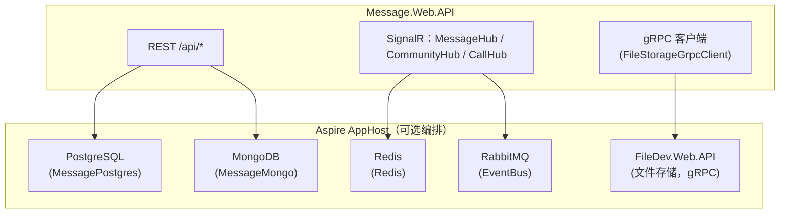

# Message 消息服务 · 项目文档

> 项目概述、技术栈、目录结构、运行/配置方式、数据模型与外部依赖。面向运维、部署与接手项目的人员。

---

## 1. 项目简介

**Message 消息服务** 是 NotBlog 社交平台的即时通讯与内容社区服务，聚合了四类核心能力：

- **即时通讯**：私聊 / 群聊 / 社区频道（Channel）会话，多类型消息（文本/图片/视频/语音/文件/位置/链接/表情），消息撤回、转发、已读回执、未读计数，基于 SignalR 的实时收发与断线补推。
- **实时音视频通话**：WebRTC over SignalR，Mesh 全网状拓扑，支持 1 对 1 与群组通话、忙线判定、响铃超时兜底、断线自愈，Redis 存储通话状态保证跨实例一致。
- **内容社区（微博式）**：推文（Tweet）、评论、点赞/收藏/分享/投币、时间线/趋势、话题（Topic）、举报与管理员审核。
- **兴趣社区（Discord 式）**：圈子（Circle）邀请制加入、成员角色管理、圈子帖子流、关注体系与社区频道聊天。

- **对外接口**：HTTP REST（`/api/*`，15 组）+ SignalR 实时通道（3 个 Hub）+ gRPC 客户端（消费 FileDev 文件存储服务）。
- **双存储**：聊天消息与会话走 MongoDB（`chat_message` / `chat_session`），社交域（群组/推文/圈子/好友/用户）走 PostgreSQL（EF Core）。
- **运行模式**：单机独立运行（依赖本地 PostgreSQL/MongoDB/Redis/RabbitMQ），或在 Aspire AppHost 编排下作为微服务运行。

---

## 2. 技术栈

| 类别 | 选型 | 版本 |
| --- | --- | --- |
| 运行时 / 语言 | .NET | net10.0 / C# 12 |
| Web 框架 | ASP.NET Core Minimal API + SignalR | 10.x |
| ORM（社交域主库） | EF Core + Npgsql (PostgreSQL) | 10.0.x |
| 聊天存储 | MongoDB.Driver（`chat_message` / `chat_session`） | 3.0.0 |
| 缓存 / 在线状态 / 通话状态 | StackExchange.Redis | 3.1.13 |
| 消息总线 | RabbitMQ（`EventBus` 封装） | — |
| 应用架构 | NotMediator（MediatR 变体） | 2.0.1 |
| 文件存储（下游） | gRPC 客户端（调用 FileDev.Web.API） | Grpc.Net 2.83.0 |
| 认证 | JWT（`JWToken` 封装，HS384） | — |
| API 文档 UI | Scalar + OpenAPI | 2.16.x |
| 容器化 | Docker（multi-stage build） | — |

> 依赖仓库内共享基础库：`Commons`、`CacheMemory`、`EventBus`、`JWToken`、`NotBlog.ServiceDefaults`（Aspire 服务默认）。

---

## 3. 解决方案结构（相关项目）

```
NotBlog/
├─ Message.Domain         # 领域层（实体、值对象、枚举、领域事件、仓储/服务接口、选项）
├─ Message.Infrastructure # 基础设施层（EF/DbContext、Mongo 文档/仓储、Redis 服务、迁移、事件）
├─ Message.Web.API        # 应用/表现层（REST 端点、SignalR Hub、CQRS 命令/查询、事件处理、gRPC 客户端）
└─ docs/                  # 本文档集（Message 服务文档）
```

### 3.1 Message.Domain 目录

```
Dto/PagedResult.cs            # 分页结果
Entities/
  Chat/                       # 消息与会话
    ChatSession.cs            # 会话聚合根（Private/Group/Channel）
    ChatSessionMemberState.cs # 成员维度会话状态（未读/置顶/免打扰）
    Message.cs                # 消息聚合根（多态 MessageContent 承载载荷）
    FileAttachment.cs         # 消息附件
    MessageFriends.cs         # 好友关系
  Community/                  # 兴趣社区
    Circle.cs CircleMember.cs CircleInvitation.cs Topic.cs UserFollow.cs
  Forward/MessageForward.cs   # 消息转发记录
  Group/Group.cs GroupMember.cs
  Tweet/                      # 推文及互动/审核/通知/举报
    Tweet.cs Comment.cs TweetInteraction.cs TweetAuditLog.cs
    TweetMedia.cs TweetNotification.cs TweetReport.cs
  User/UserInfo.cs UserSignIn.cs
Enums/                        # MessageType/MessageStatus/SessionType/RecallReason/…（22 个枚举）
Events/                       # 领域事件（MessageSentEvent/GroupCreatedEvent/CircleMemberJoinedEvent/… 44 个）
IRepository/                  # 仓储接口（16 个）
IServices/                    # 领域服务接口（IConnectionManager/IMessageRecallPolicy/IPermissionService/…）
Options/                      # DbContextOption/GenerateCircleInvitationOption/TurnServiceOptions
ValueObjects/
  Message/                    # MessageContent 多态值对象族
    MessageContent.cs TextContent.cs ImageContent.cs VideoContent.cs AudioContent.cs
    FileContent.cs LocationContent.cs LinkContent.cs ExpressionContent.cs
  Tweet/LinkMetadata.cs
  FileSize.cs GeoLocation.cs
GlobalUsings.cs
```

### 3.2 Message.Infrastructure 目录

```
EntityConfig/                 # EF 实体配置（每实体一文件，19 个）
EntityFramework/
  MessageDbContext.cs         # DbContext + IUnitOfWork（SaveEntitiesAsync 先分发领域事件）
  MessageDbContextFactory.cs  # 设计时工厂（迁移用）
IntegrationEvents/CommunityIntegrationEvents.cs  # 集成事件模型
Migration/MessageMongoMigrationService.cs        # PG → Mongo 存量迁移
Migrations/                   # EF Core 迁移（MessageDb / ReconcileMessageDomainModel / AddChatSessionCircleId）
Mongo/
  ChatMessageDocument.cs      # 消息文档投影（纯 POCO，附体内嵌）
  ChatSessionDocument.cs      # 会话文档投影（含乐观锁 Version）
  ChatSessionMemberStateDocument.cs
  ChatMessageMapper.cs ChatSessionMapper.cs      # 文档 ↔ 实体互转
  MongoChatCollection.cs      # 集合装配（类映射 + 幂等索引）
Repository/                   # 仓储实现（19 个；MongoMessageRepository/MongoChatSessionRepository 为聊天读写）
Services/
  CurrentUserService.cs       # 当前用户（JWT Claim）
  RedisConnectionManager.cs   # 连接管理（IConnectionManager + IConnectionCommandService）
  MessageCacheService.cs SessionCacheService.cs  # 消息/会话缓存
  UnreadCountCacheService.cs UserStatusCacheService.cs
  DefaultMessageRecallPolicy.cs DefaultSensitiveWordFilter.cs
  DefaultImageModerationService.cs DefaultEmailSender.cs DefaultLocalizationService.cs
  RabbitMqCommunityEventPublisher.cs DefaultCommunityEventPublisher.cs
  IConnectionCommandService.cs
ServiceCollectionExtensions.cs  # DI 统一装配（仓储 + 服务 + Mongo 仓储覆盖）
```

### 3.3 Message.Web.API 目录

```
APIs/                         # HTTP 端点组（15 个：Audit/Circles/Comments/Files/Follows/Friends/
                              #   Groups/Messages/Notifications/Reports/Sessions/Topics/Tweets/UserInfo/Turn）
Application/
  Commands/<模块>/            # CQRS 命令 + Handler（80+ 个）
  Queries/<模块>/             # CQRS 查询 + Handler（50+ 个）
  DomainEventHandlers/        # 领域事件处理（31 个）
  IntegrationEvents/EventHandlers/  # 集成事件处理（RegisterByUserAvatar 等）
  CommunityAccessGuard.cs FileAccessGuard.cs   # 访问守卫
Dto/                          # ApiResponse + Request/Response DTO + Call 通话 DTO
Extensions/                   # ServiceCollectionExtensions / MimeTypeMap / AsyncEnumerableStream
Grpc/                         # FileStorageGrpcClient（gRPC 文件客户端）
Hubs/                         # MessageHub / CommunityHub / CallHub + IMessageClient/ICommunityClient/ICallClient
Middleware/                   # UserContextMiddleware / ExceptionHandlingMiddleware
Protos/filestorage.proto      # 下游 gRPC 契约（客户端模式）
Services/
  MessageDeliveryService.cs   # 消息并行推送（连接/群组双通道）
  CommunityDeliveryService.cs # 圈子频道推送
  CallSessionStore.cs         # 通话状态机（Redis + HubContext）
  TurnCredentialService.cs    # TURN 限时凭证签发
  SafeContentSanitizer.cs SensitiveWordFilter.cs TweetVisibilityPolicy.cs
Dockerfile                    # 多阶段构建（EXPOSE 8084）
Program.cs                    # 启动装配（15 组 API + 3 个 Hub）
appsettings.json              # 配置
```

---

## 4. 运行方式

### 4.1 依赖拓扑图



### 4.2 前置依赖

| 依赖 | 用途 | 默认连接（单机） |
| --- | --- | --- |
| PostgreSQL | 社交域元数据（群组/推文/圈子/好友/用户） | `Host=localhost;Database=messagepostgres` |
| MongoDB | 聊天消息与会话（`notblog_message` 库） | `mongodb://127.0.0.1:27017` |
| Redis | 连接管理 / 缓存 / 在线状态 / 通话状态 | 本机默认端口 |
| RabbitMQ | 事件总线（集成事件、社区事件） | `guest@localhost` |
| FileDev.Web.API | 文件上传/下载/分片（gRPC） | 服务发现或 `FileStorageGrpc:Address` |

### 4.3 单机启动

```bash
# 在解决方案根目录 f:\NotBlog 下
dotnet run --project Message.Web.API/Message.Web.API.csproj
```

- 未配置 `ConnectionStrings:MessagePostgres` 时自动回落 `DbContextOption:DbContextConnection`（单机分支）；已配置则走 Aspire 分支。
- 存量数据迁移（PG → Mongo，一次性）：设置环境变量 `ChatMigration__BackfillOnStartup=true` 启动即执行，幂等（upsert）。

### 4.4 Aspire 编排启动

在 AppHost 编排下，`AddServiceDefaults()` 自动完成服务发现；连接串由 AppHost 注入 `MessagePostgres` / `MessageMongo` / `EventBus` / `Redis`，FileDev 地址经服务发现解析（虚拟主机名 `filedev-web-api`）。

### 4.5 容器化

```bash
# 在解决方案根目录 f:\NotBlog 下执行
docker build -f Message.Web.API/Dockerfile -t notblog/message-web-api .
docker run -p 8084:8084 notblog/message-web-api
```

镜像为多阶段构建（`sdk:10.0.400-noble-amd64` → `aspnet:10.0.11-noble-amd64`），运行时暴露 **8084** 端口。

### 4.6 开发环境 API 文档

开发环境自动挂载：

- OpenAPI：`GET /openapi/v1.json`
- Scalar UI：`GET /scalar/v1`

---

## 5. 数据模型

### 5.1 双存储策略

| 数据域 | 存储 | 说明 |
| --- | --- | --- |
| 聊天消息 `Message` | MongoDB `chat_message` | 消息正文 + 内嵌附件，聚合读路径 |
| 聊天会话 `ChatSession` | MongoDB `chat_session` | 含 Participants / MemberStates / Version 乐观锁 |
| 社交域（群组/推文/圈子/好友/用户/通知等） | PostgreSQL（EF Core） | 关系模型 + 领域事件分发 |

> 聊天域由 Mongo 仓储（`MongoMessageRepository` / `MongoChatSessionRepository`）读写，社交域保留 EF 仓储；消息发送的领域事件副作用（如附件记录）仍经 EF `IUnitOfWork` 提交。

### 5.2 MongoDB 集合与索引（`notblog_message` 库）

| 集合 | 索引 | 用途 |
| --- | --- | --- |
| `chat_message` | `(SessionId, SentTime desc)` | 会话历史分页 |
| `chat_message` | `(ReceiverId, Status)` | 离线补推 |
| `chat_message` | `(SenderId, SentTime desc)` | 已发消息查询 |
| `chat_session` | `Participants`（多键） | 会话列表 / 未读总览 |
| `chat_session` | `SessionType` | 按类型查询 |
| `chat_session` | `CircleId` | 社区频道会话定位 |

> 索引创建为幂等操作（重名忽略），多实例启动不冲突。

### 5.3 核心聚合根

| 聚合根 | 关键字段 / 行为 | 说明 |
| --- | --- | --- |
| `Message` | `Content`（多态 `MessageContent`）、`Status`、`SentTime`、`IsRecalled` | 8 种工厂方法（文本/图片/视频/音频/文件/位置/链接/表情）；`Recall()` 受 `IMessageRecallPolicy` 约束 |
| `ChatSession` | `SessionType`、`GroupId`、`CircleId`、`Participants`、`MemberStates` | 私聊/群聊/社区频道三种工厂；成员维度置顶/免打扰/未读；`Rebuild()` 从 Mongo 重建 |
| `Group` | `GroupName`、`OwnerId`、`MaxMembers`、`IsDismissed` | 群组事实单一真相源，ChatSession 经 GroupId 只读投影 |
| `Circle` | `OwnerGuid`、`Name`、`Status`、`MaxMembers` | 邀请制社区，社区名/解散状态为单一真相源 |
| `Tweet` | `Content`、`Visibility`、`TweetStatus`、互动计数、`HotScore` | 审核流（Pending→Approved/Rejected）、圈子帖免审核 |
| `MessageFriends` | `FriendId`、`Status`、`IsBlocked`、`IsStarred` | 好友关系与请求处理 |

### 5.4 领域事件（部分）

| 事件 | 触发方 | 主要消费者 |
| --- | --- | --- |
| `MessageSentEvent` | `Message` | 推送/通知 |
| `SessionCreatedEvent` | `ChatSession` | 会话初始化 |
| `GroupCreatedEvent` / `GroupDissolvedEvent` | `Group` | 会话同步创建/解散 |
| `CircleCreatedEvent` / `CircleDissolvedEvent` | `Circle` | 社区频道会话同步 |
| `CircleMemberJoinedEvent` / `CircleMemberLeftEvent` | `CircleMember` | 会话参与者同步、频道推送 |
| `TweetCreatedEvent` / `TweetApprovedEvent` | `Tweet` | 通知/审核日志 |
| `CommentAddedEvent` / `TweetInteractionEvent` | 评论/互动 | 通知、圈子实时推送 |

---

## 6. 配置说明（appsettings.json）

| 配置节 | 说明 |
| --- | --- |
| `CorsSettings:AllowedOrigins` | 生产环境跨域白名单（空白名单拒绝一切跨域） |
| `JwtOptions` | JWT 签发/校验（HS384，ExpireSeconds=7200） |
| `FileStorageGrpc` | FileDev gRPC 地址与分片参数（ChunkSize=5MB，超时 120s） |
| `EventBus` | RabbitMQ 连接与消费者（`message_community_events`） |
| `CommunityEventBus:Enabled` | 社区事件发布到 RabbitMQ（false 时为 No-op 实现） |
| `DbContextOption:DbContextConnection` | 单机模式 PostgreSQL 连接 |
| `MongoDb:ConnectionString / Database` | 单机模式 MongoDB 连接与库名（默认 `notblog_message`） |
| `TurnService` | coturn 限时凭证（SharedSecret / Urls / TtlSeconds） |
| `ChatMigration:BackfillOnStartup` | 存量聊天数据迁移开关（默认关闭） |

---

## 7. 部署注意事项

1. **JWT 双通道认证**：REST 走 `Authorization: Bearer`；SignalR（WebSocket 无法带自定义头）从 query string `access_token` 读取，三个 Hub 路径均已覆盖。
2. **CORS 安全**：生产环境必须配置白名单；禁止 `AllowAnyOrigin` 与 `AllowCredentials` 共存。
3. **FileDev 依赖**：文件上传/下载/分片强依赖 FileDev.Web.API 的 gRPC 服务，需先行部署；DEBUG 下跳过证书校验，Release 使用系统证书。
4. **跨实例一致性**：连接管理 / 在线状态 / 未读计数 / 通话状态全部以 Redis 为权威来源，可水平扩容。
5. **迁移任务**：`ChatMigration__BackfillOnStartup=true` 用于一次性 PG→Mongo 存量迁移，完成后应移除该配置。
