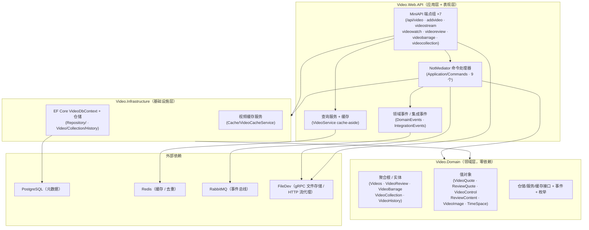

# Video 视频服务 · 开发文档

> 面向在本项目上做开发的工程师。描述架构分层、核心模式、关键业务链路、编码约定与扩展指南。
> 覆盖范围：`Video.Domain` / `Video.Infrastructure` / `Video.Web.API` 三个项目。
> 配套文档：`Video-项目文档.md`（部署/运维视角）、`Video-交接文档.md`（近期变更与遗留事项）、
> `Video-互动计数与作者通知-实施文档.md`（互动/通知实现细节）、`Video-热点-设计方案.md`（热点榜待实施）。

---

## 1. 架构总览

严格遵循 **DDD 分层**，依赖方向单一：`Web.API → Infrastructure → Domain`（Web.API 也直接依赖 Domain）。



### 1.1 各层职责

**Domain（领域层，零依赖）**
- 不引用 Infrastructure / Web.API；仅依赖 `NotMediator`（抽象）与 `Commons`。
- 聚合根：`Videos`（视频）、`VideoHistory`（观看历史）、`VideoCollection`（收藏夹）。
- 值对象族：`VideoQuote`（视频计数）、`ReviewQuote`（评论赞踩，v1.0 新增）、`VideoControl`（展示/删除/公开度/弹幕开关/定时保护）、`ReviewContent`（评论多类型内容）、`VideoImage`、`TimeSpace`。
- 只定义接口：`IVideoRepository` / `IVideoCollectionRepository` / `IVideoHistoryRepository` / `IVideoService`（查询）/ `IVideoCacheService`。

**Infrastructure（基础设施层）**
- `VideoDbContext`：实现 `IUnitOfWork`，`SaveEntitiesAsync` 内先派发领域事件（`DispatchDomainEventsAsync`）。
- 仓储：`VideoRepository` / `VideoCollectionRepository` / `VideoHistoryRepository`。
- 缓存：`VideoCacheService`（Redis 热层，cache-aside，见 §3.3）。

**Web.API（应用层 + 表现层）**
- MiniAPI 端点组（7 组），命令/查询走 `NotMediator`（CQRS）。
- 集成事件发布走 `EventPublishing.PublishSafelyAsync`（尽力而为，v1.0）。
- `VideoServiceDI`：端点场景的依赖聚合 record（仓储 + 缓存 + Mediator + Logger）。

## 2. 核心模式

### 2.1 CQRS：命令写、查询读

- **写路径**：端点组装 Command → `NotMediator.SendAsync` → Handler 从仓储加载实体（必须被 DbContext 跟踪）→ 实体行为方法 → `SaveEntitiesAsync`（派发领域事件 + 落库）→ 缓存失效/增量。
  > ⚠️ 铁律：写路径绝不能用缓存反序列化的实体直接 `SaveChanges`（未跟踪会静默丢失变更），必须走仓储加载。
- **读路径**：`VideoService`（cache-aside）或端点直接查仓储；私有/定时视频在端点层做访问控制（S-07）。

### 2.2 实体行为方法

所有状态变更收敛在聚合根行为方法内（`AddByVideoBarrage` / `AddByVideoReview` / `DeleteVideo` / `SetProtectedTime` 等），并内部 `ResetUpdateAt` 时间戳、必要时 `AddDomainEvent`。领域事件在 `SaveEntitiesAsync` 时统一派发。

### 2.3 值对象与计数

| 值对象 | 承载 | 字段 | 备注 |
|---|---|---|---|
| `VideoQuote` | `Videos` / `VideoCollection` / `VideoBarrage` | Upvote/Stars/Watch/Down/Ballot/Share | `Interlocked` 原子增减，减操作下限 0 |
| `ReviewQuote` | `VideoReview`（v1.0） | Like/Dislike | 评论专属，与原 VideoQuote 语义隔离 |
| `VideoControl` | 视频/评论/收藏/弹幕 | 权限与展示控制 + 定时保护 | JSON 列存储 |
| `ReviewContent` | `VideoReview` | text/image/video/richtext 四型 | JSON 列 + `ReviewContentOptions` 静态配置校验 |

> EF 映射：所有值对象以 `OwnsOne(…).ToJson()` 存 JSON 列；`VideoReview.Quote` 经 `VideoReviewDbContextConfiguration` 映射为 `Quote` 列（JSON：`c_Like` / `c_Dislike`）。

### 2.4 缓存（Redis 热层）

`VideoCacheService`（`Cache/VideoCacheService.cs`）实现 `IVideoCacheService`：
- **元数据**：`video:meta:{videoGuid}` JSON，30min TTL；
- **列表**：`video:list:*`（all/page/name/blurred），5min/3min TTL，`InvalidateVideoListsAsync` 清前缀；
- **计数哈希**：`video:quote:{videoGuid}` / `video:review-quote:{reviewGuid}`（Like/Dislike），2h TTL；评论赞踩写入经 `IncrementReviewQuoteFieldAsync`；
- **观看去重**：`video:watch-window:{videoGuid}:{userGuid}`，SetNX 5min（S-18）；
- **互动去重**：`video:interact:once:{videoGuid}:{userGuid}:{field}`，SetNX 30 天（v1.0，点赞/投币「首次」通知判定）。

读写策略：读穿 cache-aside，写失效/增量双写；缓存失败不影响业务主流程（仅日志）。

### 2.5 事件与安全发布（v1.0）

- 领域事件（Domain）：`UploadVideoDomainEvent`、观看三事件（Started/ProgressUpdated/Completed）；
- 集成事件（发布侧 `Application/IntegrationEvents/Events/`）：
  - `VideoPublishedIntegrationEvent`（视频发布）；
  - `VideoInteractionIntegrationEvent`（点赞/投币，**仅首次**，routing=VideoInteraction）；
  - `VideoCommentPublishedIntegrationEvent`（顶级→作者 / 回复→被回复者，routing=VideoCommentPublished）。
- 发布统一走 `EventPublishing.PublishSafelyAsync(bus, evt, logger)`：总线故障仅记日志，不阻塞主流程（与 Markdown 服务同模式）。

### 2.6 幂等与身份信任

- 命令带 `RequestId`（`Guid.CreateVersion7()`），关键写命令声明 `IIdempotentRequest`；
- **服务端解析身份**：所有互动/上传/删除的归属用户一律 `ICurrentUserService.GetUserId()` 取 JWT，忽略客户端传入 Guid（S-07/S-18.2）；
- `LikeVideoCommandHandler` 的互动「首次」判定用 Redis SetNX（取消操作不删键，已通知过不再通知）。

## 3. 关键业务链路

### 3.1 视频发布（上传）

```
HTTP multipart → AddVideoEndpoints
  1. 格式白名单（.mp4/.webm/.mkv/.mov/.avi/.flv）＋ 500MB 上限（413）
  2. 服务端解析 UserId
  3. gRPC 调用 FileDev（Bearer token 经 IHttpContextAccessor 透传）
     - 视频文件 UploadFile（FileIdentity.FilePrivate + ContentId/ContentType=Video）
     - 封面 UploadImage（可选，3840×2160 上限）
  4. 建 Videos 实体 → AddByVideoAsync → SaveEntitiesAsync（发 UploadVideoDomainEvent）
  5. 发 VideoPublishedDomainEvent → VideoPublishedIntegrationEvent（PublishSafelyAsync）
  6. InvalidateVideoListsAsync（新视频立即可见）
```
> ⚠️ `BuildCallOptions` 必须用 `IHttpContextAccessor` 取 token：NotMediator 是 Singleton，Handler 内 `ICurrentUserService` 拿到的是新 scope 实例（token 恒空）。

### 3.2 播放与观看统计

- `GET /api/videostream/{videoGuid}`：访问控制（公开/私有/定时保护 403）→ `FileDevProxy` HTTP 转发（**Range 透传** 支持拖动，206 Partial Content）→ `VideoQuote.UpWatch()`。
- `POST /api/videowatch/{videoGuid}/progress|end`：驱动 `VideoHistory` 聚合根（开始→进度只进不退→结束），进度 ≥90% 标记完成；领域事件（Started/Completed/ProgressUpdated）由 `SaveEntitiesAsync` 派发。
- 观看去重：`video:watch-window:{videoGuid}:{userGuid}` SetNX 5min，同一「视频+用户」窗口内只计 1 次 `UpWatch`；异常不阻断流响应。

### 3.3 视频互动与作者通知（v1.0）

```
点赞/投币：LikeVideoCommandHandler
  1. 计数落库（Upvote/Ballot …）
  2. 首次判定：SetNX(video:interact:once:V:U:field) 成功
  3. TargetUserId = Affiliated 首个非操作者 → 发 VideoInteractionIntegrationEvent
  4. （Redis 故障 → 跳过通知，仅日志）

评论/回复：AddVideoReviewCommandHandler
  1. AddByVideoReview(reviewId=RequestId, …) → 落库
  2. 顶级评论 TargetUserId=作者；回复 TargetUserId=被回复评论作者
  3. 发 VideoCommentPublishedIntegrationEvent（正文预览截 50 字）

消费端（Message 服务）：
  自互动过滤（Actor==Target 跳过）→ VideoNotificationCopyBuilder 文案
  → TweetNotification 落库 → SignalR 实时推送（离线 /api/notifications 补拉）
```

### 3.4 评论赞踩（ReviewQuote，v1.0）

`POST /api/videoreview/{reviewGuid}/like`（Field: upvote/down）→ `QuoteVideoReviewCommandHandler`：
1. `review.Quote.UpLike/DownLike/UpDislike/DownDislike`（下限 0）；
2. 落库 + `InvalidateVideoReviewCachesAsync` 等缓存清理；
3. `IncrementReviewQuoteFieldAsync(reviewGuid, "like"|"dislike", ±1)` 增量写 Redis 哈希。

### 3.5 收藏（Stars 计数，v1.0）

`AddVideoToCollectionCommandHandler` / `RemoveVideoFromCollectionCommandHandler`：
- 收藏关系增删成功后，`video.VideoQuote.UpStars()/DownStars()` + `UpdateByQuoteAsync`（计数失败仅日志，不阻断收藏关系已提交）；
- 重复加入/移除返回幂等成功，不重复计数。

### 3.6 弹幕

`/api/videobarrage`：文本（≤100 字符，S-17 长度上限 + `HtmlEncode` 防 XSS）/ 图片 / 混合；获取过滤 `!IsDelete`；删除仅作者（服务端解析）。

## 4. 端点总览

| 路由组 | 方法 | 能力 |
|---|---|---|
| `/api/addvideo` | POST | 上传视频+封面（gRPC→FileDev） |
| `/api/video` | GET/PUT/DELETE | 列表/分页/精确名/模糊搜；更新（作者校验）；删除（仅作者）；POST like（upvote/down/ballot/share） |
| `/api/videostream` | GET | 流式播放（Range 透传 + 访问控制 + 观看计数） |
| `/api/videowatch` | POST/GET | 进度上报（progress/end）、观看统计 |
| `/api/videoreview` | POST/GET | 评论增查、回复树、互动查询、评论赞踩（upvote/down） |
| `/api/videobarrage` | POST/GET/DELETE | 弹幕增查删 |
| `/api/videocollection` | GET/POST/DELETE | 收藏夹查询、加入/移除视频 |

统一响应包装：`VideoResult<T>`（`VideoResultType` + statusCode + message + data）。

## 5. 安全与审计要点

| 编号 | 约束 | 位置 |
|---|---|---|
| S-07 | 私有/定时视频仅作者或其授权者可见（列表/流/评论读写均判）；收藏夹归属校验 | 各端点 `IsAccessForbidden` / Handler 归属判断 |
| S-17 | 弹幕文本 ≤100 字符 + HTML 净化；上传格式白名单 + 500MB | VideoBarrageEndpoints / AddVideoEndpoints |
| S-18 | 观看计数 SetNX 5min 去重；观看/点赞/弹幕归属用户服务端解析 | StreamVideo / WatchStats / LikeVideo / Barrage |
| — | 全局异常脱敏中间件（`UseNotBlogExceptionHandler`，无内部路径泄漏） | Program.cs |
| — | 事件 `TargetUserId` 由发布侧服务端确定，消费端不作视频域反查 | LikeVideo / AddVideoReview |

## 6. 编码约定与扩展指南

1. **新增命令**：`Application/Commands/{X}Command.cs`（record + `IRequest<{X}Result>`，带 `RequestId`）→ `{X}CommandHandler.cs`（构造注入仓储/缓存/总线；写路径从仓储加载实体；结束调 `PublishSafelyAsync` 发集成事件；文档注释）。
2. **新增端点**：`Apis/{X}Endpoints.cs` 静态类 `Map{X}Endpoints`，复用 `VideoServiceDI`，统一 `VideoResult<T>` 包装与错误码。
3. **新增事件**：发布侧 `Application/IntegrationEvents/Events/` 定义 + `[EventBusName]`；消费侧 Message 服务按「过滤→文案→落库→推送」四步实现（参照 `VideoInteractionIntegrationEventHandler`）。
4. **缓存键**：一律经 `VideoCacheKeys` 常量生成，严禁散落字符串。
5. **`Videos` 实体构造函数内联 `VideoGuid`**：注意 `VideoGuid` 为 `init` 属性，对象初始化器赋值（`new Videos(...) { VideoGuid = ... }`，见测试基建用法）。
6. **领域构造注意**：`VideoControl.VideoControlBuilder()` 依赖 `VideoProtectedTime.Create(null,null)` 对 null→MinValue 的语义（v1.0 修复）；`VideoReview` 私有构造占位 `Content = new ReviewContent()`（真实内容由公开构造 `CreateDefault` 覆盖）——**不要**改回 CreateText(空串) 会抛。

## 7. 测试约定

- `Video.Tests/`（NUnit + Moq，加入 Solution）：值对象（ReviewQuote/VideoQuote 原子与下限）、命令处理器（Like/AddReview/QuoteReview 的事件、去重、归属断言）；
- 命令处理器测试共用 `Commands/VideoFixtures.cs`（Videos 构造 + 仓储/缓存/总线/Redis Mock 装配）；
- 运行：`dotnet test Video.Tests/Video.Tests.csproj`（当前 27/27）。