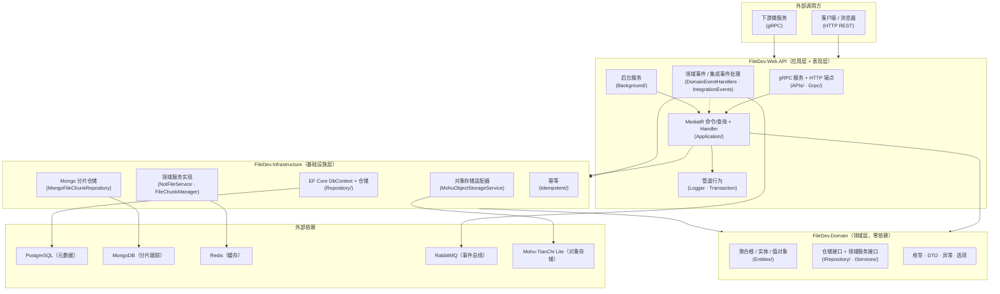
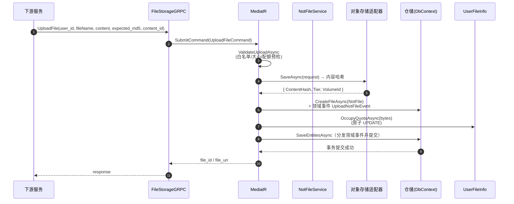
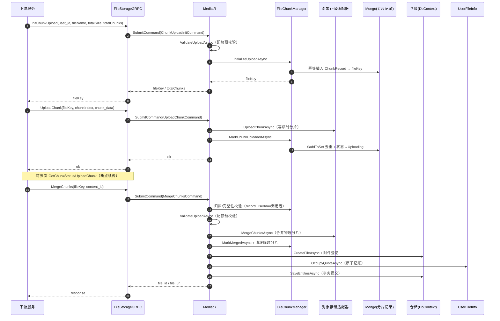
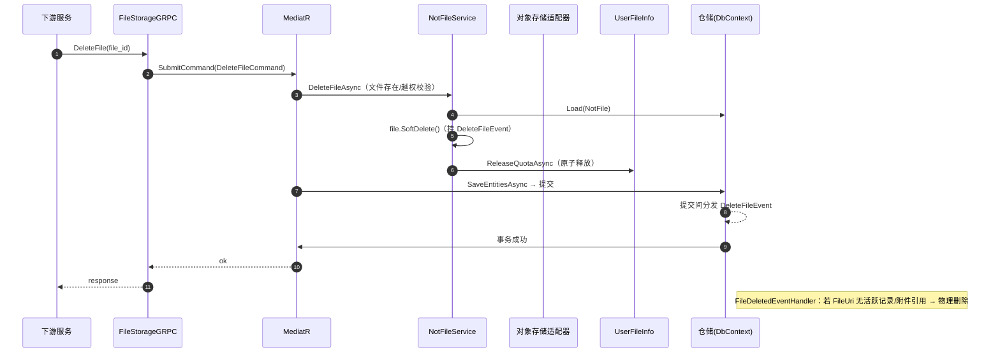

# FileDev 文件存储服务 · 开发文档

> 面向在本项目上做开发的工程师。描述架构分层、核心模式、关键业务链路、编码约定与扩展指南。

---

## 1. 架构总览

严格遵循 **DDD 分层**，依赖方向单一：`Web.API → Infrastructure → Domain`（Web.API 也直接依赖 Domain）。



### 1.1 各层职责

**Domain（领域层）**
- 不许引用 Infrastructure / Web.API；仅依赖 `NotMediator`（抽象）与 `Commons`。
- 核心聚合根：`NotFile`（文件）、`NotFileTag`（标签）、`NotFileVolume`（数据卷）、`UserFileInfo`（用户额度）、`ContentAttachmentRef`（附件引用）。
- 领域事件定义在 `FileDev.Domain/Events`：`UploadNotFileEvent` / `DeleteFileEvent` / `ChangeFileDataEvent`。
- 仓储与领域服务**只定义接口**，实现下沉到基础设施层。

**Infrastructure（基础设施层）**
- `EntityFramework/NotFileDbContext`：PostgreSQL EF Core，同时实现 `IUnitOfWork`（事务 + 领域事件分发）。
- `Repository/*`：仓储实现。分片跟踪改走 `MongoFileChunkRepository`（MongoDB）。
- `Service/*`：领域服务与对象存储适配器。
- `Idempotent/`：请求幂等管理。
- `ModuleInitializer`：统一装配 DI（仓储/服务/对象存储/Lite）。

**Web.API（应用层 + 表现层）**
- `APIs/*`：HTTP 端点（挂载路由）。
- `Grpc/`：gRPC 服务实现与拦截器。
- `Application/Commands / Queries`：MediatR 请求与处理器。
- `Application/Behaviors`：管道行为（日志、事务）。
- `Application/DomainEventHandlers / IntegrationEvents`：领域/集成事件处理。
- `Background/`：后台托管服务。
- `Middleware/`、`Protos/`、`Program.cs`。

---

## 2. 核心模式与依赖

### 2.1 MediatR（NotMediator）命令/查询

所有写操作走**命令（Command）**、读操作走**查询（Query）**，经 `INotMediator.SendAsync` 分发：

- 命令：`UploadFileCommand`、`ChunkUploadInitCommand`、`UploadChunkCommand`、`MergeChunksCommand`、`CreateTagCommand`、`DeleteFileCommand` 等。
- 查询：`GetFileInfoQuery`、`ListUserFilesQuery`、`ChunkStatusQuery`、`DownloadFileQuery`、`GetImageInfoQuery`。
- 每个 Handler 只做**组装与编排**，纯业务规则保留在领域实体/领域服务内。

### 2.2 管道行为（Pipeline Behaviors）

按注册顺序执行：

1. **`LoggerBehavior`**：入参/耗时日志（只记类型名，**不序列化请求体**，避免敏感大对象入日志）。
2. **`TransactionBehavior`**：为 `IRequest<TResponse>` 开启数据库事务。事务内 `SaveEntitiesAsync` 先分发领域事件再 `SaveChanges`，成功后统一提交、异常回滚。

### 2.3 领域事件

- 领域实体通过 `AddDomainEvent(...)` 挂载事件，`NotFileDbContext.SaveChangesAsync` 前由 `INotMediator.DispatchDomainEventsAsync` 分发。
- 典型：`NotFile.SoftDelete()` → `DeleteFileEvent` → `FileDeletedEventHandler`（见 [FileDeletedEventHandler.cs](file:///f:/NotBlog/FileDev.Web.API/Application/DomainEventHandlers/FileDeletedEventHandler.cs)，处理物理文件回收）。

### 2.4 集成事件（跨服务，EventBus/RabbitMQ）

- 由应用层 `IntegrationEvents/EventHanding` 处理：
  - `RegisterByUserIntegrationEventHandler`：新用户注册事件 → 预置 4 个默认标签 + 初始化额度记录。
  - `FileCreatedIntegrationEventHandler` / `FileDeletedIntegrationEventHandler`：文件增删事件，当前仅消费记录。
  - `FileCreatedIntegrationEvent` / `FileDeletedIntegrationEvent` / `RegisterByUserIntegrationEvent`：事件模型。
- 订阅客户端名：`filedev_events`，交换机 `notcomd_event_bus`（Direct，与 Identity / Message / Markdown / Video 统一）。

### 2.5 仓储 + 工作单元

- 仓储接口继承 `IRepository<TEntity, IUnitOfWork>`，暴露 `UnitOfWork`。
- EF 仓储共享同一个 `NotFileDbContext`，配合 `SaveEntitiesAsync` 保证同一请求内多写操作的事务原子性。
- **分片跟踪**不建 EF 工作单元，直接走 MongoDB（见 2.6）。

### 2.6 分片上传（方案 B：MongoDB）

- 文档类型 `FileChunkRecord`（纯 POCO，无领域事件），仓储 `MongoFileChunkRepository`。
- 集合 `file_chunk_records`，`FileKey` 唯一索引支撑幂等初始化。
- 并发去重用 `$addToSet`（跨实例安全，无需信号量/Redis 双写）；状态过滤避免「已合并/已取消」记录复活。
- 过期未完成任务由 `ChunkCleanupBackgroundService` 每小时清理（物理删临时文件 + 删文档）。

### 2.7 幂等

- HTTP 创建类端点读取 `X-Idempotency-Key` 头（缺失回退随机 GUID）。
- `IdentifiedCommand<TCommand,TResponse>` 包装 + `RequestManagement`/`IRequestManagement` 落库判重。
- 应用场景：`CreateNotFileCommand`、`CreateTagCommand` 等。

---

## 3. 关键业务链路

> 说明：`验证器=GrpcJwtAuthInterceptor`（JWT 身份），`管道=TransactionBehavior`（事务）。`FileStorageGRPC` 为薄适配器，只做参数映射与 `SendAsync`。

### 3.1 小文件上传（gRPC `UploadFile`）



文本步骤（对应时序图序号）：

```
① ValidateUploadAsync(userId, fileName, size)
②    → 扩展名白名单 / 大小上限 / 用户配额预校验（读 UserFileInfo 记账表）
③    → 可选 SHA256 校验（expected_md5）
④ StorageService.SaveAsync（写 Lite，命中去重返回内容哈希）
⑤ CreateFileAsync（构建 NotFile + InsertFile + 领域事件 UploadNotFileEvent）
⑥ 内容附件：ContentAttachmentService.RegisterAsync（解析 content_id/cmd）
⑦ OccupyQuotaAsync（原子占用配额）
⑧ TransactionBehavior 统一提交；失败则补偿删除物理文件
```

### 3.2 分片上传（大文件）



文本步骤：

```
InitChunkUpload → ValidateUploadAsync 预校验 → FileChunkManager.InitializeUploadAsync（写 Mongo 记录）→ 返回 fileKey
UploadChunk     → FileChunkManager.MarkChunkUploadedAsync（$addToSet 去重 + 状态→Uploading）
GetChunkStatus  → 查 Mongo 返回已上传分片集合（断点续传）
MergeChunks     → 归属校验(record.UserId==调用者)
               → 分片完整性校验 → ValidateUploadAsync 配额预校验
               → StorageService.MergeChunksAsync（合并物理分片）
               → MarkMergedAsync（置 Merged + 清理临时分片）
               → CreateFileAsync + 附件登记 → OccupyQuotaAsync 记账
CancelChunkUpload → MarkCancelledAsync + CleanupChunksAsync
```

### 3.3 删除文件



### 3.4 秒传（DeduplicateFileCommand）

`GetDeduplicateFileAsync(md5, size, userId)`：优先返回调用者自己的未删记录；命中即复用同一 FileUri，不重复写物理文件。

### 3.5 内容附件弱引用（方案 C）

- 附件文件 `Source = ContentAttachment`，通过 `ContentAttachmentRef` 记录「业务内容(content_id, content_type) → FileUri」引用，`ActiveRefs` 计数。
- 业务内容删除时调用 `UnregisterContentAttachments` → 引用清零且无新引用才物理删除附件。

### 3.6 标签自动归类

- 新用户注册：预置 `图片/文档/文件/视频` 四个默认标签（`FileTagDefaults.DefaultKinds`）。
- 上传：`FileTagDefaults.ResolveDefaultKind(fileName)` 按扩展名归类（单源事实），幂等。
- 默认标签可改名，自动归类由 `DefaultKind`（非名称）定位。

---

## 4. 配额记账设计（UserFileInfo）

- 一用户一行额度记录，`UserId` 为业务主键；字段：`TotalQuotaBytes`（0 不限制）、`UsedBytes`。
- **写入前**：`ValidateUploadAsync` 读记账表预检（缺失则惰性建账，初始已用量用文件表聚合兜底）。
- **写入后**：`OccupyQuotaAsync` → `IUserFileInfoRepository.TryOccupyAsync` 用 `ExecuteUpdateAsync` 原子 `UPDATE`（条件内联额度判断，杜绝并发丢失更新）。
- **删除**：`ReleaseQuotaAsync` → 原子减量，结果不低于 0。
- 领域方法：`Occupy / Release / AdjustQuota`（供事务内读改写路径与额度动态调整）。

---

## 5. 认证与安全

- **JWT**：`GrpcJwtAuthInterceptor`（gRPC）+ ASP.NET `AddJwtAuthentication`（HTTP）。调用者 id 一律取服务端解析值，不信任客户端传参。
- **扩展名白名单**：`FileCheckTypeMiddleware`（multipart 上传）+ `ValidateUploadAsync`（全链路上传）双重校验，小写化匹配防绕过。
- **路径穿越**：`FileApiHelpers.BuildFileKey` 生成 GUID 文件名；`GetSafeFullPathAsync` 清洗 + 根目录内校验。
- **危险类型**：`.html/.htm/.svg` 从白名单移除，下载一律 `application/octet-stream`。
- **gRPC 异常映射**：`GrpcExceptionMapperInterceptor` 业务异常 → 语义化状态码，未知异常不泄露内部细节。

---

## 6. 编码约定

1. **分层职责**：领域层零依赖；业务规则放领域实体/领域服务，Handler 只做编排；Storage 只做 IO。
2. **一个文件一个类**；类/文件按功能放入对应目录（`Entities/`、`Repository/`、`Commands/` 等）。
3. **公开成员必有文档注释**（`/// <summary>`），关键前置条件、异常、幂等语义需写明。
4. **仓储职责**：能复用既有方法就复用；配额/分片写入优先用数据库原子操作，避免进程内锁。
5. **日志**：可预期业务失败用 `Warning`，异常用 `Error`；**禁止记录请求体大对象**。
6. **不信任客户端输入**：userId 处处以服务端解析的调用者为准；文件名做路径穿越校验。
7. **错误处理**：领域异常（`NotFileException` 子类）映射到语义化 HTTP/gRPC 状态码，统一响应 `{ ok, error }`。

---

## 7. 扩展指南

### 新增一个 gRPC/HTTP 能力（示例：新增「统计文件数」）

1. Domain 定义接口方法（如 `INotFileRepository.GetFileCountByUserIdAsync` 已存在）。
2. Web.API 新增 `Query`（`GetFileCountQuery`）+ `QueryHandler`。
3. 在 `FileStorageServiceGRPC` 增加 RPC 实现（作为薄适配器，调 `_mediator.SendAsync`），并在 `filestorage.proto` 增加消息与 `rpc`。
4. （HTTP 同理）在对应 `APIs/*.cs` 挂载端点。也可用 `OpenAPI + Scalar`（仅在 Development 生效）联调。

### 新增领域能力（示例：新增「文件分组」）

1. Domain 新增聚合根 + 领域事件 + 仓储/服务接口。
2. Infrastructure 新增 EF 配置（`EntityConfig/` 单文件）、仓储实现、迁移（`dotnet ef migrations add`）。
3. Web.API 新增命令/查询 + Handler + 端点；如需跨服务，增加集成事件模型与 Handler，并在 `Program.cs` 注册。
4. 在 Domain/Infrastructure/Web.API 各自 `GlobalUsings` 补充 `using`，DI 在 `ModuleInitializer`（Infrastructure）或 `Program.cs`（Web.API）注册。

---

*开发文档基于当前代码梳理，链路细节以命令/查询 Handler 与领域服务实现为准。*