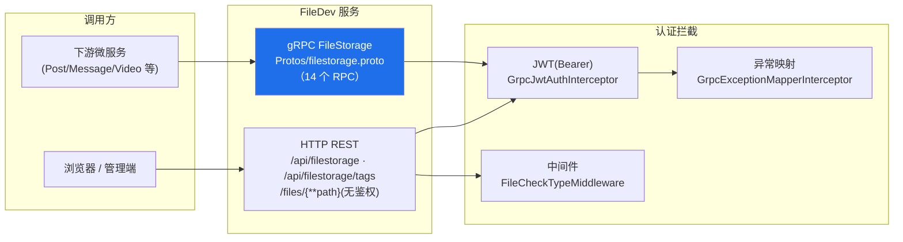

# FileDev 文件存储服务 · 接口文档

> 适用范围：`FileDev.Web.API` / `FileDev.Infrastructure` / `FileDev.Domain` 三个项目对外暴露的所有接口。
> 服务提供两套访问通道：**gRPC**（`FileStorage` 服务，多语言/微服务调用）与 **HTTP REST**（`/api/filestorage`，浏览器/管理端）。

---

## 1. 通用约定

### 1.1 通道与地址



| 通道 | 协议 | 默认监听 | 认证方式 |
| --- | --- | --- | --- |
| gRPC | HTTP/2 proto | `https://localhost:9093` / `http://localhost:62436` | JWT（Bearer） |
| HTTP REST | HTTP/1.1 JSON | 同 Kestrel 端口 | JWT（Bearer），下载除外 |

> 端口见 `FileDev.Web.API/Properties/launchSettings.json`。Aspire 编排环境下由 AppHost 注入实际地址。

### 1.2 认证

- **HTTP**：请求头 `Authorization: Bearer <JWT>`。除下述「无鉴权」端点外，`/api/filestorage` 分组整体要求 JWT；未认证返回 `401`。
- **gRPC**：元数据（metadata）中加入 `authorization: Bearer <JWT>`。由 `GrpcJwtAuthInterceptor` 统一校验签名与有效期，并将服务端解析出的调用者 id 写入请求上下文 —— **客户端传入的 `user_id` 一律被忽略，归属校验以服务端解析结果为准**。

### 1.3 幂等（HTTP）

创建类操作支持幂等：请求头 `X-Idempotency-Key: <GUID>`。缺失或非法 GUID 时回退为随机键（该请求不保证幂等）。

### 1.4 统一响应格式（HTTP REST）

除下载端点外，HTTP 接口统一返回 JSON 对象，形如：

```jsonc
// 成功
{ "ok": true, ...业务字段 }
// 失败
{ "ok": false, "error": "错误描述" }
```

状态码：`200` 成功 / `400` 参数错误 / `401` 未认证 / `403` 无权 / `404` 不存在 / `500` 服务端错误。

### 1.5 统一响应格式（gRPC）

每个 gRPC 响应均携带 `success: bool` 与 `error_message: string`。业务异常由 `GrpcExceptionMapperInterceptor` 统一映射为 gRPC 状态码：

| 领域异常 | gRPC 状态码 |
| --- | --- |
| `NotFileNotFoundException` | `NotFound` |
| `FilePermissionDeniedException` / `UnauthorizedAccessException` | `PermissionDenied` |
| `FileQuotaExceededException` | `ResourceExhausted` |
| `ArgumentException` | `InvalidArgument` |
| `OperationCanceledException` | `Cancelled` |
| 其余未知异常 | `Internal`（不泄露内部细节） |

> 映射响应均通过 trailers 携带 `x-correlation-id`，便于联调追踪。

---

## 2. gRPC 接口（`FileStorage` 服务）

proto 定义见 `FileDev.Web.API/Protos/filestorage.proto`，共 14 个 RPC，按功能分五组。

### 2.1 枚举定义

```protobuf
enum FileIdentity {  UNSPECIFIED=0; PUBLIC=1; PRIVATE=2; PRIVATE_PUBLIC=3; PASSWORD_PROTECTED=4; }
enum FileType      {  UNSPECIFIED=0; IMAGE=1; VIDEO=2; AUDIO=3; DOCUMENT=4; COMPRESS=5; OTHER=6; }
enum ChunkUploadStatus { UNSPECIFIED=0; PENDING=1; UPLOADING=2; MERGED=3; FAILED=4; CANCELLED=5; }
enum ContentType   {  NONE=0; POST=1; MARKDOWN=2; VIDEO=3; }
```

### 2.2 通用消息

- **`FileInfo`**：`file_id, user_id, file_name, file_description, file_size, file_uri, file_md5, file_identity, file_type, file_tags[], upload_time, update_time, is_deleted`
- **`ImageInfo`**：`file_info:FileInfo, width, height, format`

### 2.3 文件元数据操作

| RPC | 请求 → 响应 | 说明 |
| --- | --- | --- |
| `GetFileInfo` | `GetFileInfoRequest{file_id}` → `GetFileInfoResponse{success, file_info, error_message}` | 查询单文件信息；调用者非所有者返回 `PermissionDenied`。 |
| `ListUserFiles` | `ListUserFilesRequest{user_id, page, page_size}` → `ListUserFilesResponse{success, files[], total_count, error_message}` | 分页列出调用者自己的文件；**忽略客户端 `user_id`**。 |
| `DeleteFile` | `DeleteFileRequest{file_id, user_id}` → `DeleteFileResponse{success, error_message}` | 软删除，并触发物理文件回收与配额释放。 |
| `UpdateFileInfo` | `UpdateFileInfoRequest{file_id, file_name, file_tags[], file_description, file_identity, file_md5}` → `UpdateFileInfoResponse{success, file_info, error_message}` | 仅文件所有者可更新。 |

### 2.4 小文件上传 / 下载

| RPC | 请求 → 响应 | 说明 |
| --- | --- | --- |
| `UploadFile` | `UploadFileRequest{user_id, file_name, file_content(bytes), file_tags[], file_description, file_identity, expected_md5, content_id, content_type}` → `UploadFileResponse{success, file_id, file_uri, file_md5, file_size, error_message}` | 单请求上传 ≤ 100MB；`expected_md5` 可选做 SHA256 校验；`content_id/content_type` 用于内容附件弱引用。上传成功占用用户存储配额。 |
| `DownloadFile` | `DownloadFileRequest{file_id, user_id}` → **stream** `DownloadFileResponse{chunk_data, file_name, file_size, content_type}` | 流式下载，服务端按分块推送。 |

### 2.5 大文件分片上传

| RPC | 请求 → 响应 | 说明 |
| --- | --- | --- |
| `InitChunkUpload` | `InitChunkUploadRequest{user_id, file_name, total_size, total_chunks, file_md5, file_type, file_identity, file_tags[], file_description}` → `InitChunkUploadResponse{success, file_key, total_chunks, chunk_size, error_message}` | 初始化分片任务，返回 `file_key`（后续分片操作的业务标识）。同时做配额预校验。 |
| `UploadChunk` | `UploadChunkRequest{file_key, chunk_index, chunk_data, chunk_md5}` → `UploadChunkResponse{success, chunk_index, chunk_md5, error_message}` | 上传单个分片。分片索引去重由 MongoDB `$addToSet` 原子保证。 |
| `GetChunkStatus` | `GetChunkStatusRequest{file_key}` → `GetChunkStatusResponse{success, file_key, total_chunks, uploaded_chunks[], status, error_message}` | 查询断点续传状态（已上传分片索引 + 任务状态）。 |
| `MergeChunks` | `MergeChunksRequest{file_key, user_id, file_name, file_tags[], file_description, content_id, content_type}` → `MergeChunksResponse{success, file_id, file_uri, file_md5, file_size, error_message}` | 合并分片为完整文件并落库，成功后记账。含分片归属/完整性/配额校验。 |
| `CancelChunkUpload` | `CancelChunkUploadRequest{file_key}` → `CancelChunkUploadResponse{success, error_message}` | 取消上传并清理临时分片。 |

### 2.6 图片专用操作

| RPC | 请求 → 响应 | 说明 |
| --- | --- | --- |
| `UploadImage` | `UploadImageRequest{user_id, file_name, image_content, file_tags[], file_description, file_identity, validate_format, max_width, max_height, content_id, content_type}` → `UploadImageResponse{success, file_id, file_uri, file_md5, file_size, width, height, format, error_message}` | 上传图片；`validate_format=true` 时做魔数+扩展名一致性校验。 |
| `DownloadImage` | `DownloadImageRequest{file_id, user_id, resize_width, resize_height}` → **stream** `DownloadImageResponse{chunk_data, file_name, file_size, content_type, width, height}` | 流式下载图片（可选缩放参数，当前实现按原图返回）。 |
| `GetImageInfo` | `GetImageInfoRequest{file_id}` → `GetImageInfoResponse{success, image_info, error_message}` | 查询图片信息（含宽高/格式）。 |

### 2.7 内容附件回收

| RPC | 请求 → 响应 | 说明 |
| --- | --- | --- |
| `UnregisterContentAttachments` | `UnregisterContentAttachmentsRequest{content_id, content_type}` → `UnregisterContentAttachmentsResponse{success, unregistered_count, error_message}` | 注销某业务内容（帖子/Markdown/视频）下的全部附件引用，并对「不再被任何内容引用」的附件执行物理删除。 |

---

## 3. HTTP REST 接口

所有端点统一前缀如下：

| 分组 | 前缀 | 认证 |
| --- | --- | --- |
| 分片/流式/卷 | `/api/filestorage` | 全部需 JWT |
| 标签 | `/api/filestorage/tags` | 全部需 JWT |
| 下载 | `/files/{**path}` | **无鉴权**（URL 不可枚举） |

### 3.1 分片上传 `/api/filestorage/chunk`

#### 3.1.1 初始化分片上传 `POST /api/filestorage/chunk/init`

请求体：
```jsonc
{ "fileName": "video.mp4", "totalSize": 10485760, "chunkSize": 5242880,
  "fileMd5": "…", "isPublic": false, "description": "可选" }
```
响应：
```jsonc
{ "ok": true, "fileKey": "…", "totalChunks": 2, "chunkSize": 5242880, "uploadedChunks": [] }
```
限制：`totalSize ∈ (0, MaxFileSize]`（默认 10GB），`chunkSize > 0`。

#### 3.1.2 上传分片 `POST /api/filestorage/chunk/upload`（multipart/form-data）

表单字段：`fileKey`、`chunkIndex`、`chunkContent`（文件）。单分片上限 `ChunkFileSize × 2`。
响应：
```jsonc
{ "ok": true, "chunkIndex": 0, "received": true, "size": 5242880 }
```

#### 3.1.3 查询分片状态 `GET /api/filestorage/chunk/status/{fileKey}`

```jsonc
{ "ok": true, "fileKey": "…", "totalChunks": 2, "uploadedChunks": [0],
  "isComplete": false, "status": "Uploading" }
```

#### 3.1.4 合并分片 `POST /api/filestorage/chunk/merge`

请求体：`{ "fileKey": "…" }`
响应：
```jsonc
{ "ok": true, "fileKey": "…", "fileName": "video.mp4", "fileUri": "/files/…" }
```

#### 3.1.5 取消分片上传 `POST /api/filestorage/chunk/cancel/{fileKey}`

```jsonc
{ "ok": true, "cancelled": true, "fileKey": "…" }
```

### 3.2 流式上传与秒传 `/api/filestorage/stream`、`/api/filestorage/dedup`

#### 3.2.1 流式上传 `POST /api/filestorage/stream/upload`（raw body）

请求头：`X-File-Name`（必填，不含路径分隔符）、`X-File-Size`（可选）。请求体为原始字节流。
限制：`size ∈ (0, 100MB]`。
响应：
```jsonc
{ "ok": true, "fileName": "a.txt", "fileUri": "/files/…" }
```

#### 3.2.2 秒传检查 `POST /api/filestorage/dedup/check`

请求体：`{ "fileMd5": "…", "fileSize": 1024 }`
响应：
```jsonc
{ "ok": true, "exists": true, "fileId": "…", "fileUri": "/files/…" }
```
`exists=false` 时 `fileId/fileUri` 为空。

### 3.3 数据卷管理 `/api/filestorage/volume`

> 管理员/系统调用，挂载在需 JWT 的分组下。

| 方法 & 路径 | 请求体 | 响应 | 说明 |
| --- | --- | --- | --- |
| `GET /` | — | `{ ok, volumes:[NotFileVolumeInfoDto] }` | 卷清单统计。 |
| `GET /{volumeId}` | — | `{ ok, volume }` | 单卷信息；不存在返回 `400`。 |
| `POST /sync` | — | `{ ok, synced }` | 从 Lite 注册表全量同步卷记录。 |
| `POST /shared` | `{ "rootPath": "…" }` | `{ ok, volume }` | 新增共享卷。 |
| `POST /tenant` | `{ "tenantId": "…", "rootPath": "…" }` | `{ ok, volume }` | 新增租户专属卷。 |
| `GET /dirs` | — | `{ ok, directories:[NotFileDirectoryInfoDto] }` | 虚拟目录统计。 |
| `POST /{path}/tier` | `{ "tier": "Hot"\|"Cold" }` | `{ ok, manifest }` | 调整对象存储层；对象不存在返回 `400`。 |

### 3.4 标签管理 `/api/filestorage/tags`

| 方法 & 路径 | 请求体 | 响应 | 说明 |
| --- | --- | --- | --- |
| `POST /` | `{ "name": "重要", "description": "可选" }` | `{ ok }` | 创建标签（用户内唯一）。 |
| `GET /` | — | `{ ok, data:[TagResponse] }` | 列出当前用户全部标签。 |
| `PUT /{tagId}` | `{ "newName": "改名后" }` | `{ ok }` | 重命名标签。 |
| `DELETE /{tagId}` | — | `{ ok }` | 软删除标签。 |
| `POST /{tagId}/files/{fileId}` | — | `{ ok }` | 文件加入标签。文件不存在/已删返回 `404`。 |
| `DELETE /{tagId}/files/{fileId}` | — | `{ ok }` | 文件移出标签。 |
| `GET /{tagId}/files` | — | `{ ok, data:[TagFileResponse] }` | 标签下文件列表；非本人标签返回 `403`。 |

`TagResponse` 字段：`tagId, tagName, tagDescription, isDefault, fileIds[], uploadTime, updateTime`。
`TagFileResponse` 字段：`fileId, fileName, fileSize, fileUri, fileMd5, fileTags[], uploadTime`。

### 3.5 文件下载 `/files/{**path}`（无鉴权）

`GET /files/{userId}/{guid}{ext}` —— 前端 ``/直接访问 fileUri 的通道。

- **无鉴权**：文件名是 v7 GUID（128 位随机、不可枚举），泄露 URL 即视为有权限访问。
- **支持 Range**（`enableRangeProcessing`）：视频拖动、图片渐进加载。
- **可缓存**：`Cache-Control: public, max-age=86400`（文件内容不可变）。
- **安全**：相对路径经存取服务清洗并校验根目录内（防路径穿越）；`.html/.htm/.svg` 一律按 `application/octet-stream` 返回（防浏览器直接渲染 XSS）。

---

## 4. 公共对象存储服务接口（内部服务接口 `INotFileStorageService`）

底层对象存储适配 `Mohu-TianChi Lite`，面向文件读写、分片、清单与数据卷：

| 方法 | 说明 |
| --- | --- |
| `SaveAsync(request)` | 保存整文件（支持去重、哈希校验、覆盖策略）。 |
| `DeleteAsync(relativePath)` | 删除对象。 |
| `GetContentAsync / GetContentStreamAsync` | 读取内容 / 流式读取（大文件防整读）。 |
| `CleanupChunksAsync(fileKey)` | 清理指定任务的临时分片。 |
| `ExistsAsync(relativePath)` | 判断对象是否存在。 |
| `UploadChunkAsync / MergeChunksAsync / GetTotalChunkCountAsync` | 分片写入 / 合并 / 印刷数。 |
| `GetManifestAsync / ChangeStorageTierAsync` | 对象清单读取 / 存储层（Hot↔Cold）调整。 |
| `AddVolumeAsync / AddTenantVolumeAsync / GetVolumeStatsAsync / GetDirectoryStatsAsync` | 数据卷与目录统计管理。 |

---

## 5. 配额与监控语义

- **写入前校验**：上传/分片初始化/合并在写入前统一做配额预校验（读 `UserFileInfo` 记账表）。
- **写入后记账**：文件创建成功后占用配额（原子 UPDATE，配额不足抛 `FileQuotaExceededException` → gRPC `ResourceExhausted`）。
- **删除释放**：软删除时释放对应文件占用配额。
- **自动归类**：上传文件按扩展名自动归入默认标签（图片/文档/文件/视频），见 `FileTagDefaults`。

---

*文档编制自代码梳理，接口定义以 `Protos/filestorage.proto` 与 `FileDev.Web.API/APIs/*.cs` 为准。*