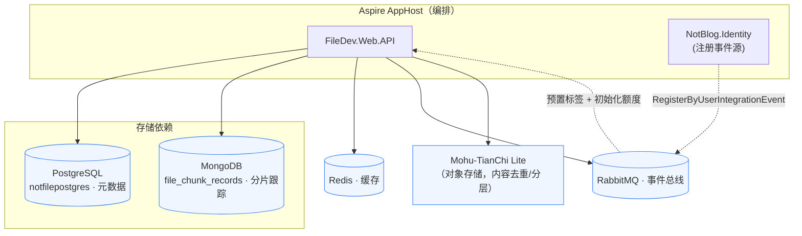

# FileDev 文件存储服务 · 项目文档

> 项目概述、技术栈、目录结构、运行/配置方式、数据模型与外部依赖。面向运维、部署与接手项目的人员。

---

## 1. 项目简介

**FileDev 文件存储服务** 是一个独立、可单机运行、也可纳入 Aspire 微服务编排的文件与图片存储服务。提供小文件上传、大文件分片断点续传、秒传去重、图片格式校验、用户存储配额管理、标签分类、对象存储分层（Hot/Cold）与内容附件弱引用回收能力。

- **对外接口**：gRPC（`FileStorage` 服务）+ HTTP REST（`/api/filestorage`）。
- **多运行模式**：单机独立运行（依赖本地 PostgreSQL/MongoDB/Redis/RabbitMQ），或在 AppHost 编排下作为服务运行。
- **存储后端**：内容寻址对象存储 `Mohu-TianChi Lite`（块级去重、数据卷、生命周期存分层）。

---

## 2. 技术栈

| 类别 | 选型 | 版本 |
| --- | --- | --- |
| 运行时 / 语言 | .NET | net10.0 / C# 12 |
| Web 框架 | ASP.NET Core Minimal API + gRPC | 10.x |
| ORM（主库） | EF Core + Npgsql (PostgreSQL) | 10.0.x |
| 分片跟踪库 | MongoDB.Driver | 3.0.0 |
| 缓存 | StackExchange.Redis（`CacheMemory` 封装） | 3.1.13 |
| 消息总线 | RabbitMQ（`EventBus` 封装） | — |
| 应用架构 | NotMediator（MediatR 变体） | 2.0.1 |
| 对象存储 | Mohu-TianChi Lite | 1.0.2 |
| 认证 | JWT（`JWToken` 封装） | — |
| API 文档 UI | Scalar + OpenAPI | 2.16.x |

> 依赖的是仓库内共享基础库：`Commons`、`CacheMemory`、`EventBus`、`JWToken`、`NotBlog.ServiceDefaults`（Aspire 服务默认）。

---

## 3. 解决方案结构（相关项目）

```
NotBlog/
├─ FileDev.Domain         # 领域层（实体、仓储/服务接口、枚举、DTO、异常、选项）
├─ FileDev.Infrastructure # 基础设施层（EF/DbContext、仓储、对象存储适配、幂等）
├─ FileDev.Web.API        # 应用/表现层（gRPC、HTTP、MediatR、事件、后台任务）
└─ docs/                  # 本文档集（接口、开发、项目）
```

### 3.1 FileDev.Domain 目录

```
Dto/Request Response      # 传输对象
Entities/                 # 聚合根与实体
  NotFile.cs              # 文件聚合（含存储元数据、领域事件、Builder）
  NotFileTag.cs           # 标签聚合（多对多文件集合）
  NotFileVolume.cs        # 数据卷聚合
  UserFileInfo.cs         # 用户存储额度
  ContentAttachmentRef.cs # 附件弱引用
  FileChunkRecord.cs      # 分片文档（Mongo POCO）
Enum/                     # FileType/FileIdentity/StorageTier/ContentType/ChunkUploadStatus/TagDefaultKind/VolumeKind/FileSource/StorageType
Events/                   # UploadNotFileEvent/DeleteFileEvent/ChangeFileDataEvent
Exception/                # NotFileException + 业务异常
IRepository/              # 仓储接口
IServices/                # 领域服务接口
Options/                  # NotFileStorageOptions/DbContextOption
ValueObjects/FileSize.cs  # 值对象
IRepository/ IRepository<T,E>    # 仓库泛型基接口
IRepository/ IUnitOfWork # 工作单元
FileTagDefaults.cs        # 默认标签与自动归类规则（单源事实）
```

### 3.2 FileDev.Infrastructure 目录

```
EntityConfig/             # EF 实体配置（每实体一文件）
EntityFramework/NotFileDbContext.cs  # DbContext + IUnitOfWork
Repository/               # EF 仓储 + MongoFileChunkRepository（分片）
Service/                  # NotFileService/FileChunkManager/ContentAttachmentService/FileStorageService/NotFileVolumeService
Service/MohuObjectStorageService/    # Lite 适配器（Chunks/Manifest/Volumes 分部类）
Idempotent/               # 请求幂等（ClientRequest/RequestManagement）
Mongo/MongoChunkCollection.cs        # 分片集合装配（类映射 + 唯一索引）
Migrations/               # EF Core 迁移
ModuleInitializer.cs      # DI 统一装配（AutoAddInstance 驱动）
```

### 3.3 FileDev.Web.API 目录

```
APIs/                     # HTTP 端点（Chunk/Stream/Download/Volume/Tag + Helpers)
Application/
  Commands/ Queries/      # MediatR 命令/查询 + Handler
  Behaviors/              # LoggerBehavior / TransactionBehavior
  DomainEventHandlers/    # 领域事件处理
  IntegrationEvents/      # 集成事件模型 + Handler
Background/               # ChunkCleanupBackgroundService / VolumeSyncBackgroundService
Grpc/                     # FileStorageServiceGRPC + JWT/异常拦截器 + ImageValidator
Middleware/               # FileCheckTypeMiddleware
Protos/filestorage.proto  # gRPC 契约
Program.cs                # 启动装配
appsettings.json          # 配置
```

---

## 4. 运行方式

### 4.1 依赖拓扑图



> 单机运行时不依赖 AppHost，由 `appsettings.json` 指向本地 PostgreSQL/MongoDB/Redis/RabbitMQ，注册事件改为由事件消费驱动。

### 4.2 单机独立运行

**前置依赖**（本地拉起或远程指向）：
- PostgreSQL（主库 `notfilepostgres`）
- MongoDB（分片跟踪，库 `notfile`）
- Redis（缓存）
- RabbitMQ（集成事件）

启动：

```powershell
# 在 FileDev.Web.API 目录
dotnet run --project FileDev.Web.API
```

- 单机模式判定：`ConnectionStrings:EventBus` 与 `ConnectionStrings:NotFilePostgres` 均缺失 → 走 `appsettings.json`。
- 默认监听：`https://localhost:9093`、`http://localhost:62436`（见 `launchSettings.json`）。

### 4.3 Aspire 编排运行

AppHost 注入连接串 `EventBus` / `NotFilePostgres` / `NotFileMongo` / `Redis`，并注入 `TurnService__*` 等资源变量。迁移在启动时由 `dbContext.Database.Migrate()` 自动应用。

### 4.4 数据库迁移

```powershell
cd FileDev.Infrastructure
dotnet ef migrations add <名称>   # 生成迁移
# 应用迁移：启动服务自动 Migrate，或用如下命令
dotnet ef database update
```

> 生成迁移前如遇空迁移/名称冲突：先清理 `bin`/`obj`，`dotnet restore` 后重新生成（勿用 `--no-build`）。

---

## 5. 配置说明（appsettings.json）

| 配置节 | 说明 |
| --- | --- |
| `JwtOptions` | Issuer / Audiences / ExpireSeconds。签名密钥由环境变量 `JWT_PRIVATE_KEY` 提供（**不入配置文件**）。 |
| `EventBus` | RabbitMQ 连接与 Exchange（`notcomd_event_bus`）、订阅客户端名 `filedev_events`。 |
| `DbContextOption` | 单机 PostgreSQL 连接串（`DbContextConnection`）（仅单机分支读取）。 |
| `MongoDb` | `ConnectionString` / `Database`（分片跟踪，单机分支读取，默认 `mongodb://127.0.0.1:27017`）。 |
| `NotFileStorage` | 扩展名白名单、`ChunkFileSize`（5MB）、`MaxFileSize`（10GB）、`StoragePath`、`TempPath`、`ChunkExpirationHours`、`UserStorageQuota`（50GB）。 |
| `LiteStorage` | 完整覆盖 `LiteOptions`：RootPath、ChunkSize、DirectoryLimits、PersistIndex、日志、`Storage`（去重/数据目录/自动扩容/读缓存/VolumeIsolation）与 `Lifecycle`（过期/分层扫描、冷阈值）。 |

> 相对路径统一解析到应用基目录（见 `ModuleInitializer.ResolveAbsolute`）。

---

## 6. 数据模型

### 6.1 PostgreSQL（EF Core，`NotFileDbContext`）

| 表 | 说明 | 关键字段 / 约束 |
| --- | --- | --- |
| `NotFile` | 文件元数据 | 业务主键 `FileId`；`UserId`、`FileName/Size/Uri/Md5`、`Source`、`Tier`、`VolumeId`、`ShardCount`、`ContentHash`、`IsDeleted`。忽略 EF 默认 `Id`，`HasKey(FileId)`。 |
| `NotFileTag` | 标签（替代原文件组） | 业务主键 `TagId`；`UserId+TagName` 唯一、`(UserId,DefaultKind)` 归类索引；`FileIds` 多对多。 |
| `NotFileVolume` | 数据卷（镜像 Lite 注册表） | 字符串业务主键 `VolumeId`（`v{n}` 或空串）；`RootPath` 由 `Key` 唯一。 |
| `UserFileInfo` | 用户存储额度 | 主键 `UserId`；`TotalQuotaBytes/UsedBytes/UpdateTime` 必填。 |
| `ContentAttachmentRef` | 内容附件弱引用 | `ContentId + ContentType + FileUri`；`ActiveRefs` 计数；`SourceFileId` 回查。 |
| `ClientRequest` | 幂等请求登记 | 请求幂等判重。 |

迁移历史：`NotFileDb → PendingModelSync → AddLiteMetaAndVolume → AddContentSourceAndAttachmentRef → DropFileChunkRecord（删除原分片表）→ AddNotFileTag → AddUserFileInfo`。

### 6.2 MongoDB

| 集合 | 数据 | 索引 |
| --- | --- | --- |
| `file_chunk_records` | 分片上传任务（`FileChunkRecord`，`RecordId` 为 `_id`） | `FileKey` 唯一索引（幂等）、`CreatedAt` TTL（随任务清理/过期扫描） |

---

## 7. 后台任务

| 服务 | 周期 | 职责 |
| --- | --- | --- |
| `ChunkCleanupBackgroundService` | 每小时 | 清理超时未完成（> `ChunkExpirationHours`）的分片任务：删临时文件 + 删 Mongo 文档。 |
| `VolumeSyncBackgroundService` | 启动 1 次 | 启动约 3 秒后把 Lite 运行时的卷/目录统计回填至 `NotFileVolume` 表。 |

---

## 8. 领域枚举清单

| 枚举 | 取值 |
| --- | --- |
| `FileIdentity` | FilePublic / FilePrivate / FilePrivatePublic / FilePasswordProtected |
| `FileType` | FileImage / FileVideo / FileAudio / FileFile / CompressFiles / FileOther |
| `StorageTier` | Hot / Cold |
| `ContentType` | None / Post / Markdown / Video |
| `ChunkUploadStatus` | Pending / Uploading / Merged / Failed / Cancelled |
| `VolumeKind` | Default（VolumeId 空）/ Shared（非空+无租户）/ Tenant（非空+有租户） |
| `TagDefaultKind` | None / Image / Document / File / Video |
| `FileSource` | UserRepository / ContentAttachment |
| `StorageType` | Local |

---

## 9. 外部依赖与资源

- **PostgreSQL**：`notfilepostgres`（元数据主库）。
- **MongoDB**：`notfile.file_chunk_records`（分片跟踪，方案 B 后唯一依赖，无降级）。
- **Redis**：缓存（`CacheMemory`），沿用 `IRedisCacheService` 封装。
- **RabbitMQ**：集成事件总线（`EventBus` 封装）。
- **Mohu-TianChi Lite**：底层内容寻址对象存储。

---

## 10. 部署与生产注意

- JWT 签名密钥经由环境变量注入，**勿写入 `appsettings.json`**。
- 分片跟踪完全依赖 MongoDB，切换/迁移时在途分片会一次性丢失，需接受该中断并避免在维护窗口上传。
- 分片临时文件清理依赖 `ChunkCleanupBackgroundService`，部署需保证存在可用 MongoDB 连接。
- 新增外部依赖（如 MongoDB/CacheMemory 之外的）时，需在部署说明中同步标注。

---

*本文档基于当前代码梳理，配置以 `appsettings.json`、`Program.cs` 与 `ModuleInitializer.cs` 为准。*